<!--
  README.md — Public-mirror landing page for `Automations-Project/n8n-data-manager`.
  This file ships via release-manifest.txt; the publish workflow auto-bumps the
  version between <!-- AUTOVER:start -\-> markers on every release. Don't hand-edit
  the version number here — change src/initialize.sh:VERSION and CI rewrites this.
  -->

<p align="center">
  <picture>
    <source media="(prefers-color-scheme: dark)" srcset=".github/images/hero.svg">
    <source media="(prefers-color-scheme: light)" srcset=".github/images/hero-light.svg">
    
  </picture>
</p>

<h1 align="center">n8n-manager</h1>

<p align="center">
  <em>Backup &middot; Restore &middot; Migrate &middot; versioned in Git, <strong>fully self-hosted</strong>.</em>
</p>

<!-- ALL_BADGES_START -->
<p align="center">
  <a href="https://github.com/Automations-Project/n8n-data-manager/actions/workflows/ci.yml"></a>
  <a href="https://github.com/Automations-Project/n8n-data-manager/releases/latest"></a>
  <a href="LICENSE"></a>
  <a href="https://github.com/Automations-Project/n8n-data-manager/actions/workflows/ci.yml?query=branch%3Amain"></a>
</p>
<p align="center">
  <a href="https://github.com/Automations-Project/n8n-data-manager/stargazers"></a>
  <a href="https://github.com/Automations-Project/n8n-data-manager/network/members"></a>
  <a href="https://github.com/Automations-Project/n8n-data-manager/graphs/contributors"></a>
  <a href="https://github.com/Automations-Project/n8n-data-manager/issues"></a>
  <a href="https://github.com/Automations-Project/n8n-data-manager/commits/main"></a>
  
  
  
</p>
<!-- ALL_BADGES_END -->

<p align="center">
  Latest pinned version: <code><!-- AUTOVER:start -->5.0.0<!-- AUTOVER:end --></code>
  &middot; <a href="docs/cli-reference.md">CLI Reference</a>
  &middot; <a href="CHANGELOG.md">Changelog</a>
  &middot; <a href="MIGRATION.md">Migrating from v4</a>
</p>

<p align="center">
  <picture>
    <source media="(prefers-color-scheme: dark)" srcset=".github/images/divider.svg">
    <source media="(prefers-color-scheme: light)" srcset=".github/images/divider-light.svg">
    
  </picture>
</p>

`n8n-manager` is a single-file CLI for **backing up and restoring [n8n](https://n8n.io/) Docker instances to GitHub**. It exports workflows, credentials, tags, folders, projects, datatables, and variables to a source-controlled repository, and can restore them back into a running n8n container — fully reproducible, fully under your control.

Built for self-hosted n8n operators who want **versioned, recoverable backups they fully own**. Interactive (gum-styled TUI) and non-interactive (CI-friendly) modes both supported.

## Quick start

```bash
curl -fsSL https://i.nskha.com/install.sh | sudo bash
```

Drops the `n8n-manager` executable into `/usr/local/bin` and (on first run) silently auto-installs `gum` to `~/.local/share/n8n-manager/bin/` for the styled TUI.

Verify — `n8n-manager` is on `PATH` after install:

```bash
n8n-manager --version
n8n-manager --help
```

> [!TIP]
> Always use `curl -fsSL`, never bare `curl -sSL`. The `-f` flag fails-fast on any HTTP error so a WAF challenge / 5xx page never gets piped to bash.

### Install matrix

| Goal | Command | Tracks |
|---|---|---|
| **System install** (default — needs sudo) | `curl -fsSL https://i.nskha.com/install.sh \| sudo bash` | latest **release tag** on `main` |
| **User install** (no sudo, ~/.local/bin) | `curl -fsSL https://i.nskha.com/install.sh \| bash -s -- --user` | latest release tag on `main` |
| **Portable binary, system PATH** | `sudo curl -fsSL https://i.nskha.com/n8n-manager -o /usr/local/bin/n8n-manager && sudo chmod +x /usr/local/bin/n8n-manager` | latest **commit on `main`** |
| **Portable binary, user PATH** | `mkdir -p ~/.local/bin && curl -fsSL https://i.nskha.com/n8n-manager -o ~/.local/bin/n8n-manager && chmod +x ~/.local/bin/n8n-manager` | latest commit on `main` |
| **Alpha pre-release binary** | `sudo curl -fsSL 'https://i.nskha.com/n8n-manager?alpha' -o /usr/local/bin/n8n-manager && sudo chmod +x /usr/local/bin/n8n-manager` | latest commit on `alpha` |
| **Legacy v4 monolith** | `sudo curl -fsSL 'https://i.nskha.com/n8n-manager?legacy' -o /usr/local/bin/n8n-manager && sudo chmod +x /usr/local/bin/n8n-manager` | frozen `legacy` branch |
| **Uninstall** | `curl -fsSL https://i.nskha.com/install.sh \| sudo bash -s -- --uninstall --yes` | — |

> [!NOTE]
> **Two delivery channels, two semantics:**
> - **`install.sh`** is **release-pinned** — downloads the binary from a tagged GitHub release, writes a structured install with PATH wiring + gum auto-install. Pick this for production.
> - **`/n8n-manager` direct** is **branch-tip** — the worker 302-redirects to GitHub raw on the requested branch's HEAD. No PATH wiring, no gum. Pick this for docker images, CI runners, ad-hoc upgrades, or testing alpha / legacy.

`--yes` is **only** required for `--uninstall` (destructive). Fresh installs over `curl | sudo bash` accept the implicit consent of running the command, matching the convention every other installer uses (rustup, oh-my-zsh, get.docker.com, deno).

The `i.nskha.com` endpoints are served by a Cloudflare Worker that 302-redirects `/n8n-manager` → the GitHub raw URL of the requested branch. Branch names are allow-listed (`main`, `alpha`, `legacy`) so arbitrary `?branch=…` values cannot escape the public mirror.

### Verify your install — common pitfalls

```bash
n8n-manager --version    # should print 5.x.y
```

| Symptom | Cause | Fix |
|---|---|---|
| `command not found` after a portable download to `n8n-manager` (no path prefix) | Binary in current dir; `.` isn't on PATH | `./n8n-manager --version`, or `sudo mv n8n-manager /usr/local/bin/ && sudo chmod +x /usr/local/bin/n8n-manager` |
| `command not found` after a `~/.local/bin` install | `~/.local/bin` not on PATH | Add `export PATH="$HOME/.local/bin:$PATH"` to `~/.bashrc` / `~/.zshrc`, open a new shell |

### `install.sh` flags

```
--system, -s   Force install to /usr/local/bin
--user         Force install to ~/.local/bin
--portable, -p Install into current directory; no PATH change
--prefix PATH  Install to custom directory
--yes, -y      Skip confirmation prompts (required for --uninstall over a pipe)
--no-gum       Skip gum auto-install
--uninstall    Remove n8n-manager and gum
--help, -h     Print usage
```

## Branches

| Branch | Purpose | Worker route |
|---|---|---|
| **`main`** | Stable, audited, tag-released. Default for `/install.sh`. | `https://i.nskha.com/n8n-manager` |
| **`alpha`** | Rolling pre-release. Same publish pipeline as `main` but no tags / GitHub releases. Use for early validation. | `https://i.nskha.com/n8n-manager?alpha` |
| **`legacy`** | Frozen v4 monolith and pre-v5 source tree. Read-only — no further releases. | `https://i.nskha.com/n8n-manager?legacy` |

Each release is signed off by a multi-gate CI pipeline (gitleaks, manifest allow-list, monitor probe, compile, SHA-256 binary integrity).

<p align="center">
  <picture>
    <source media="(prefers-color-scheme: dark)" srcset=".github/images/divider.svg">
    <source media="(prefers-color-scheme: light)" srcset=".github/images/divider-light.svg">
    
  </picture>
</p>

## What it does

- **Canonical layout** — `workflows/`, `credential_stubs/`, `projects/`, `datatables/`, `tags.json`, `variable_stubs.json`, `folders.json`, `workflow_owners.json`, plus `.n8n-manager/{manifest,capabilities,checksums}.json` sidecars. Repository-style, diffable, restorable.
- **Three-tier read/write fallback** — n8n CLI → REST API → direct DB engine (deterministic Python SQLite + native Postgres). The probe picks the safest path on every run.
- **Pre-restore snapshot + automatic rollback** — never lose state on a failed restore.
- **Bundle layouts** — single-file `combined` payload or per-workflow `workflow-bundles` for portability.
- **Migration command** — converts v4 backup repos to the canonical v5 layout in-place.
- **Session recording** — `--record` ships a typescript + replay tape to your backup repo; GIF rendering happens on GitHub Actions, not on your host.
- **Bash-safe everywhere** — `set -Eeuo pipefail`, explicit boolean comparisons, no token logging (even under `--verbose`/`--trace`), Alpine-compatible container snippets.

## Prerequisites

- **Host:** Linux or macOS, `bash` 4+, `docker` (daemon running), `git`, `curl`. `python3` only required when the SQLite fallback path runs.
- **n8n container:** running (Alpine and Debian-based images both supported). `git` not required inside the container.
- **GitHub:** a repository (private recommended) for backups, plus a fine-grained PAT with `Contents: Read+Write` scoped to that repo only.

## Configuration

Defaults live in `~/.config/n8n-manager/config` (XDG; override with `--config <path>`). Command-line flags always override config-file values.

```bash
mkdir -p ~/.config/n8n-manager && chmod 700 ~/.config/n8n-manager
```

```ini
# ~/.config/n8n-manager/config
CONF_GITHUB_TOKEN="ghp_..."           # required (Contents: Read+Write)
CONF_GITHUB_REPO="owner/n8n-backups"  # required
CONF_GITHUB_BRANCH="main"             # optional; default 'main'
CONF_CONTAINER="n8n"                  # default container name/ID
CONF_BACKUP_TYPE="all"                # all | workflows | credentials | enterprise | full-db
CONF_BACKUP_LAYOUT="canonical"        # canonical | bundle | combined | workflow-bundles
CONF_CREDENTIAL_EXPORT_MODE="stub"    # stub | encrypted | decrypted
CONF_RESTORE_TYPE="all"               # all | workflows | credentials
CONF_N8N_API_KEY=""                   # auto-detected if absent
CONF_N8N_API_URL=""                   # auto-detected if absent
CONF_VERBOSE=false
CONF_LOG_FILE=""
CONF_RECORD=false
```

Keep this file **`chmod 600`** — it holds your PAT and (optionally) your n8n API key. Tokens are never logged.

## Usage

### Interactive

```bash
n8n-manager                # default = welcome screen + (TTY+gum) menu
n8n-manager backup         # gum-styled prompts for every required value
n8n-manager restore
```

### Quick non-interactive recipes

> 📚 Full flag-by-flag reference: **[docs/cli-reference.md](docs/cli-reference.md)**.
> All examples below are scriptable — drop them into cron, GitHub Actions, a Docker `RUN` line, or a systemd unit. Substitute `ghp_xxx` with a real PAT (or use `--token-file /path` / `--token-stdin` for hardened secret handling).

#### Backup

```bash
# 1) Default — every entity, canonical layout, push to main
n8n-manager backup -c n8n -t ghp_xxx -r user/backups

# 2) Read PAT from a 600-mode file (recommended for cron)
n8n-manager backup -c n8n --token-file /etc/n8n-manager/pat -r user/backups

# 3) Read PAT from stdin (recommended for CI)
echo "$N8N_PAT" | n8n-manager backup --token-stdin -c n8n -r user/backups

# 4) Workflows only
n8n-manager backup -c n8n -t ghp_xxx -r user/backups --backup-type workflows

# 5) Single combined-bundle file (data.n8n.backups)
n8n-manager backup -c n8n -t ghp_xxx -r user/backups --backup-layout combined

# 6) Per-workflow bundles (one .n8n.backup per seed workflow + linked deps)
n8n-manager backup -c n8n -t ghp_xxx -r user/backups --backup-layout workflow-bundles

# 7) Enterprise + full-DB snapshot (canonical only)
n8n-manager backup -c n8n -t ghp_xxx -r ops/backups --backup-type full-db

# 8) Incremental (only items changed since last backup; canonical only)
n8n-manager backup -c n8n -t ghp_xxx -r user/backups --incremental

# 9) One workflow + its linked credentials
n8n-manager backup -c n8n -t ghp_xxx -r user/backups \
  --workflow-id "wf_abc123" --include-linked-creds

# 10) Decrypted-credentials backup (private repo only — explicit opt-in)
n8n-manager backup -c n8n -t ghp_xxx -r private/secure-backups \
  --backup-type credentials --credential-export-mode decrypted
```

#### Restore

```bash
# 1) Default — full overwrite restore (probe picks safest write path)
n8n-manager restore -c n8n -t ghp_xxx -r user/backups

# 2) Dry-run — print every action, change nothing
n8n-manager restore -c n8n -t ghp_xxx -r user/backups --dry-run

# 3) Safe — only create entities that don't exist (never overwrite)
n8n-manager restore -c n8n -t ghp_xxx -r user/backups --restore-mode new-only

# 4) Force destructive cleanup (drop entities missing from backup)
n8n-manager restore -c n8n -t ghp_xxx -r user/backups --force --delete-missing

# 5) Workflows only, re-create as new entities (strip IDs)
n8n-manager restore -c n8n -t ghp_xxx -r user/backups \
  --restore-type workflows --import-as-new

# 6) Legacy v4 backup — bypass v5 adapter (emergency restore)
n8n-manager restore -c n8n -t ghp_xxx -r user/old-v4-backups --legacy-fallback

# 7) Postgres schema-drift acknowledgement (rare)
n8n-manager restore -c n8n -t ghp_xxx -r user/backups --allow-schema-drift
```

#### Import a single payload from a URL

```bash
# Single workflow JSON or bundle
n8n-manager import-url --url https://example.com/backup.json -c n8n

# Workflows only from a remote zip
n8n-manager import --url https://example.com/backup.zip -c n8n --restore-type workflows
```

#### Edit workflow files (`.n8n`) locally

```bash
# Validate every workflow in a directory; fail on warnings
n8n-manager workflow validate --all -d ./workflows --strict --json

# Strip pinned execution data (size + sample-data leaks)
n8n-manager workflow clean-pins --all -d ./workflows

# Audit-only: what would be cleaned?
n8n-manager workflow clean-pins --all -d ./workflows --check-only

# Toggle a setting on every workflow
n8n-manager workflow settings --all -d ./workflows -s mcpEnabled=false

# Activate every workflow + push to a running container
n8n-manager workflow publish --all -d ./workflows --live -c n8n

# Deactivate every workflow live
n8n-manager workflow unpublish --all -d ./workflows --live -c n8n

# Diff two workflow files
n8n-manager workflow compare --file-a ./v1.n8n --file-b ./v2.n8n

# Render a dependency graph as Mermaid markdown
n8n-manager workflow graph -d ./workflows --format mermaid -o deps.md

# Dependency report — orphans, cycles, missing refs
n8n-manager workflow report -d ./workflows --orphans --cycles --missing
```

#### Migrate

```bash
# Convert a v4 backup repo to v5 canonical layout (sibling branch)
n8n-manager migrate --source /path/to/v4-backup-repo

# Same, but write to a fresh output dir / new git repo
n8n-manager migrate --source /path/to/v4-backup-repo --target /path/to/v5-output

# Audit only — print summary, write nothing
n8n-manager migrate --source /path/to/v4-backup-repo --report-only --format markdown

# Resume an interrupted migration
n8n-manager migrate --source /path/to/v4-backup-repo --resume

# Translate a v4 config file to v5 schema in place (atomic + idempotent)
n8n-manager migrate-config

# Preview the rewrite without touching disk
n8n-manager migrate-config --dry-run
```

#### System

```bash
n8n-manager update                # check + apply latest stable
n8n-manager update --check        # check only, don't install
n8n-manager update --channel dev  # install from main-branch HEAD
n8n-manager update --rollback     # restore the prior v4 binary from .v4.bak
n8n-manager uninstall             # remove n8n-manager + gum (keeps your config)
```

Add `--dry-run` to **any** destructive command for a zero-side-effect preview. Add `--verbose` (or `--trace`) for detailed logging. Add `--log-file <path>` to append a timestamped audit log.

`backup --record` additionally pushes a session recording (typescript + replay tape) to `Backups/records/<session-id>/` in your backup repo and seeds a GitHub Actions workflow that renders GIFs from the tapes.

<p align="center">
  <picture>
    <source media="(prefers-color-scheme: dark)" srcset=".github/images/divider.svg">
    <source media="(prefers-color-scheme: light)" srcset=".github/images/divider-light.svg">
    
  </picture>
</p>

## Migrating from v4

> **TL;DR:** run `n8n-manager update` on any host with v4 installed; your config and existing backup repos keep working. To convert v4 backup-repo layouts to canonical v5, run `n8n-manager migrate`. Full guide: **[MIGRATION.md](MIGRATION.md)**.

The v5 install path takes over `/usr/local/bin/n8n-manager` and preserves the previous binary as `n8n-manager.v4.bak` so rollback is one `mv` away.

## Build (from source)

```bash
make build              # ./n8n-manager (dev, with BUILD_STAMP)
make build-prod         # ./n8n-manager-prod (production)
make rebuild            # clean + build
make test-help          # run the built CLI inside the runner container
make test-dry-run       # build + start n8n + dry-run backup smoke
```

`package.json` exposes the same operations (`npm run build`, `npm run test`, …) for hosts without `make`.

## Safety & error handling

- **Pre-flight checks** before any destructive op — dependency check, GitHub access, container running, branch existence.
- **Pre-restore snapshot** captured automatically; restored on failure.
- **`--dry-run`** on every destructive command — zero side effects.
- **Probe-driven dispatch** — CLI version, REST auth, DB backend (sqlite vs postgres) detected on every run; the safest path is chosen automatically.
- Tokens, credentials, and `.env` contents are never logged, even under `--verbose` or `--trace`.

## Logging

| Mode | Flag | What you get |
|---|---|---|
| Standard | (none) | Coloured user-friendly status messages |
| Verbose | `--verbose` | Detailed debug output, tokens still redacted |
| Trace | `--trace` | `set -x` execution trace (also redacted) |
| File | `--log-file <path>` | Plain-text, timestamped append log |

## Contributing

PRs welcome. The development happens on a private repository; this public mirror receives only audited, curated releases via [`.github/workflows/publish-release.yml`](https://github.com/Automations-Project/n8n-data-manager/blob/main/.github/workflows/publish-release.yml). Open an issue here and the maintainer will route it.

## License

MIT — see [LICENSE](LICENSE).

<p align="center">
  <picture>
    <source media="(prefers-color-scheme: dark)" srcset=".github/images/divider.svg">
    <source media="(prefers-color-scheme: light)" srcset=".github/images/divider-light.svg">
    
  </picture>
</p>
<p align="center"><sub>Made for self-hosted n8n operators who want recoverable backups they fully own.</sub></p>
